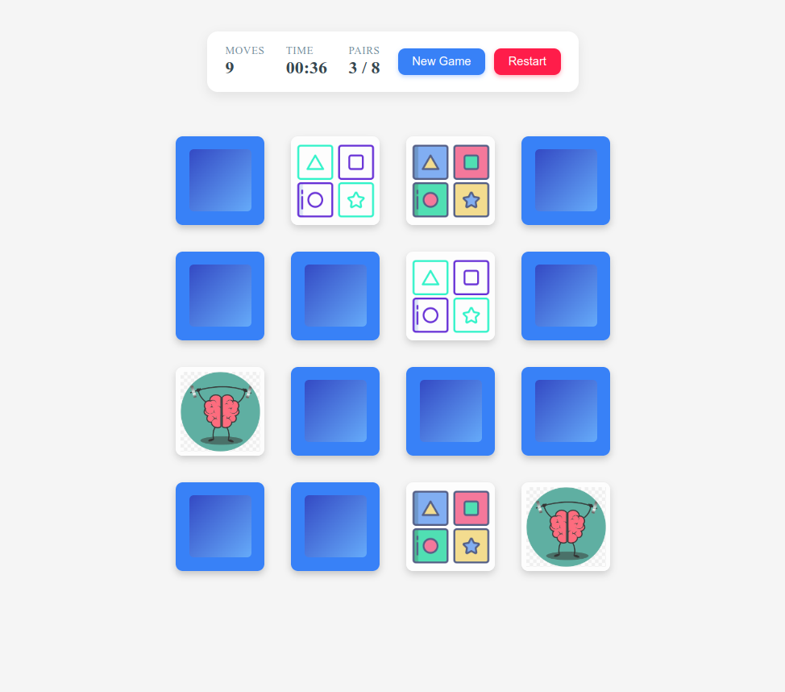

# 🧠 Memory Game

A fun and interactive memory game where players flip cards to find matching pairs. Test your memory and try to match all pairs in the fewest moves possible!





## Installation

Install the game with git

```bash
    git clone https://github.com/rajeshmbg3-developer/memory-game.git
    cd memory-game
```
## Running Game Locally

Install dependencies:

```bash
    nmp install
```

Run application:

```bash
    npm run start
```
Open `localhost:4200` to access the application!😎


## Authors

 - [Rajesh Malakar](https://github.com/rajeshmbg3-developer)